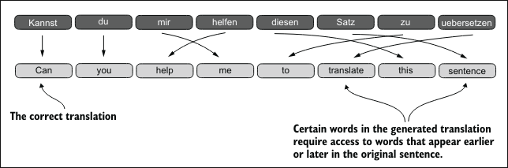

# Tworzenie Dużego Modelu Językowego
Praca oparta o książke [Build a Large Language Model - Sebastian Raschka](https://www.amazon.com/Build-Large-Language-Model-Scratch/dp/1633437167). Całość jest dostępna w również w PDF [(link na końcu)](#wszystkie-wykorzystane-źródła)

Poniżej znajduje się moje krótkie opracowanie kolejnych rozdziałów książki
> [!NOTE]
> Opracowanie rozdziały: 1, 2
# Jak działa LLM?

## Stworzenie słownika  

Słownik to tabela odwzorowań (lookup table), która zawiera tokeny – czyli fragmenty słów oraz przypisane im liczby (identyfikatory). Dzięki temu możemy zamienić język naturalny na sekwencję liczb. Fragment słownika może wyglądać następująco:  

```json
      "Ġczu": 749,
      "kim": 750,
      "Ġjakie": 751,
      "Ġczłowie": 752,
      "Ġsiebie": 753,
      "Ġ(": 754,
      "szedł": 755,
      "tnie": 756,
      "ran": 757,
      "Ġkto": 758
```

> Symbol `Ġ` oznacza spację. To sposób kodowania informacji o tym, że token pojawia się na początku słowa. Jest to technika zastosowania dla GPT-2  

Jak widać, tokeny często odpowiadają powtarzającym się fragmentom słów. Ten sam token może występować w różnych słowach, na przykład:  

- `ran`-`kiem`
- `po`-`ran`‑`na`  

W takich przypadkach token `ran` (o ID `757`) będzie użyty w słowach takich jak *rankiem*, *porankiem*, *rano* itd.  

W ten sposób całe zdanie, np. `Oto fragment przykładowego wejścia`, może zostać przedstawione jako sekwencja liczb odpowiadających tokenom, np. `3014, 7020, 2324, 1679, 3338, 735`  

Dla ilustracji proces podziału może wyglądać tak:  

```
Oto -> fragment
Oto fragment -> przykład
Oto fragment przykład -> owego
Oto fragment przykładowego -> wej
Oto fragment przykładowego wej -> ścia
```

> [!NOTE]
> W dalszych częściach będę dla uproszczenia zamiennie stosował określenia słowo - token. Jak widzisz w rzeczywistym systemie nie jest to jednoznacznie określone.

## Osadzenie (ang. embedding)

Następnie tokeny zamienia się na wektory liczbowe w przestrzeni wielowymiarowej. Na początku (przed trenowaniem) wartości tych wektorów są losowe. Podczas treningu, dzięki propagacji wstecznej, wektory ulegają optymalizacji. Z czasem słowa używane w podobnych kontekstach (np. *kot*, *pies*) dostają wektory, które znajdują się bliżej siebie w tej przestrzeni.

Przykład: token `kot` może odpowiadać numerowi `120` w słowniku, a jego wektor początkowy wyglądać np. tak: `[1.2, 5.3]`.

### Osadzenie pozycyjne (ang. positional embedding)

Problem: sam embedding tokenu nie niesie informacji o jego pozycji w zdaniu. Dlatego do wektorów tokenów dodajemy wektory pozycyjne (tzw. *positional embeddings*), które działają jak *offset* zależny od tego, na którym miejscu (indeksie) w zdaniu jest dany token.

**Wracając do przykładu:**

Reprezentacja ciągu `kot kot kot` to najpierw

```
[1.2, 5.3], [1.2, 5.3], [1.2, 5.3]. <- brak informacji o pozycji
```


Następnie dodajemy wektory pozycji, np. `[1.1, 1.2], [2.1, 2.2], [3.1, 3.2]`.

```
  [1.2, 5.3], [1.2, 5.3], [1.2, 5.3]
+ [1.1, 1.2], [2.1, 2.2], [3.1, 3.2]
------------------------------------
= [2.3, 6.5], [3.3, 7.5], [4.3, 8.5]
```

Otrzymując wektor końcowy: `[2.3, 6.5], [3.3, 7.5], [4.3, 8.5]`

Dzięki temu w ostatecznym wektorze mamy zakodowaną zarówno informację o tym, **jaki** to token, jak i o tym, **gdzie** występuje w zdaniu. To z kolei pozwala kolejnym warstwom modelu analizować tokeny względem siebie w kontekście całej sekwencji. 

### Dodatkowa uwaga

Powyżej został omówiony model osadzenia pozycyjnego "pozycji absolutnej" - jest to sposób jednoznacznego określenia pozycji na której znajduje się token w sekwencji. Alternatywą jest zastosowanie pozycji relatywnej - która określa jak blisko siebie znajdują się tokeny.

- Dla pozycji absolutnej podczas trenowania zaczyna się od losowych wartości - które wraz z postępem treningu są optymalizowane.
- Dla pozycji relatywnej można stosować mechanizmy takie jak [enkodowanie sinusoidalne](https://machinelearningmastery.com/a-gentle-introduction-to-positional-encoding-in-transformer-models-part-1/?utm_source=chatgpt.com)

Można powiedzieć że jest to różnica pomiędzy "gdzie jesteś" a "jak daleko ode mnie jesteś".

> [!NOTE]
> W matematycznym sensie dodanie dwóch wektorów powoduje utratę informacji (dodawanie nie jest odwracalne). Natomiast należy wziąć pod uwagę wielkość przestrzeni na jakiej operujemy - są to wektory wielowymiarowe (np. dla GPT-3 jest to 12 288 wymiarów), mamy również doczynienia z tensorami których wartości są zmiennoprzecinkowe. W takim przypadku szansa że suma dwóch różnych par losowych wektorów da ten sam wynik jest pomijalna. W praktyce wystarczy aby kombinacje sum które uzyskujemy były rozróżnialne - model nie musi "rozdzielać" pozycji i znaczenia słów, wystarczy że wyuczy się ogólnych zasad ich występowania.

## Mechanizmy samo-uwagi (ang. self-attention)
Najważniejszy jak i zarazem najtrudniejszy do zrozumienia mechanizm w LLMie. Jego celem jest określenie (numerycznej) istotności tokenów w zdaniu. 

Z lotu ptaka: Podczas generowania nowego tokena model określa jak bardzo istotny jest każdy z poprzedzających tokenów. Mechanizm ten daje modelowi możliwość zwiększenia "uwagi" na określonych słowach w poprzednich zdaniach.

Przykładowo: aby przetłumaczyć zdanie między dwoma językami których konstrukcje zdań się różnią, musisz brać pod uwagę każde słowo w zdaniu, a nie tylko tłumaczyć słowo po słowie.



Oprócz problemu kolejności dochodzi problem kontekstu. Te same słowa np. zamek czy język, mają różne znaczenia kiedy otaczają je inne słowa (polski język jest trudny - on pokazał mi język).

### Macierz kontekstu

Wynikiem działania mechanizmu uwagi jest macierz kontekstu. Jest ona kwadratowa i określa prawdopodobieństwo "istotności" każdego tokena z każdym.


> [!NOTE]
> Na rysunku wartości liczbowe są zaokrąglone.

### Naiwny mechanizm samo-uwagi

Najprostszym mechanizmem jaki można teoretycznie zastosować jest analiza podobieństwa słów w zdaniu. Oto schemat operacji dla jednego tokena:


Ważne: wynikowy wektor kontekstu to jeden wiersz macierzy kontekstu. jest to wektor kontekstu dla konkretnego tokena (w tym przypadku tokena drugiego; oznaczenie `x^(2)`) i zawiera on sumę wszystkich "wpływów na uwagę" innych tokenów w zdaniu.

### Normalizacja - funkcja softmax

Funkcja matematyczna odwzorowująca wektor liczb w wektor prawdopodobieństw, w taki sposób, żeby prawdopodobieństwa były proporcjonalne do wszystkich przekształconych liczb. [(Wikipedia)](https://pl.wikipedia.org/wiki/Funkcja_softmax)

### Poprawny mechanizm samo-uwagi

Tak naprawdę zaproponowany wyżej naiwny mechanizm nie jest realistyczny. Przecież podobieństwo słów (iloczyn skalarny osadzeń tokenów) nie odzwierciedla tego czy dane słowo jest istotne w analizowanym kontekście. Co więcej, mechanizm zaprojektowany w ten sposób nie ma możliwości analizy schematów zdań (przez trenowanie) - czyli najważniejszej umiejętności modeli LLM która umożliwia naukę języka naturalnego.

Omawiany w tym fragmencie temat jest trudny do zrozumienia. Przedstawię go w skompresowanej wersji i zachęcam do zapoznania się z kompletnymi omówieniami np. rozdział 3 omawianej książki oraz [6 rozdział świetnej serii](https://www.youtube.com/playlist?list=PLZHQObOWTQDNU6R1_67000Dx_ZCJB-3pi) 3Blue1Brown o  sieciach neuronowych.

Zasadniczą różnicą względem wyżej omówionego prostego schematu uwagi jest dodanie 3 trenowalnych macierzy wag oznaczonych `Wq`, `Wk` oraz `Wv`. Są one używane do wyznaczenia odpowiednio wektorów zapytania, klucza i wartości (ang. query, key, value) dla każdego tokenu. Poniżej omówię jak można rozumieć sens działania tych macierzy. Warto jednak mieć na uwadze że zachowanie modelu - czyli tego jak finalnie korzysta z tych macierzy, wynika wyłącznie z danych na których został on wytrenowany, a jego rzeczywiste zachowanie pozostaje niewiadome.

- **wektor zapytania** - Przez wektor zapytania można rozumieć "pytanie" do innych tokenów o określone cechy. Na przykład pytanie "Gdzie są czasowniki".

- **wektor klucza** - przez wektor klucza można rozumieć odpowiedź na pytanie o określoną cechę. To oznacza np. że wektor zapytania "Gdzie są czasowniki" powinien - przy pomocy wektora klucza aktywować tokeny które są czasownikami.

- **wektor wartości** - w wektorze wartości znajduje się zasadnicza wartość cechy którą aktywowany token posiada. Przykładowo dla czasownika "biegnie" wektor wartości powinien w jakiś sposób przekazywać sens ruchu, prędkości czy przemieszczania się - a tak naprawdę wszystkie te cechy na raz.

**Jeszcze raz**. Przedstawione przykłady nie odzwierciedlają rzeczywistego działania mechanizmów samo-uwagi. Opisane przykłady to wyłącznie efekt który spodziewamy się zauważyć w wytrenowanym modelu. Prawdziwe zachowania wynikają jednak tylko i wyłącznie z zadania optymalizacji (propagacji wstecznej) i ich prawdziwe działanie nie jest jawne.


Warto omówić dodatkowy krok podczas normalizacji wartości uwagi. W poprzednim modelu wykorzystaliśmy jedynie funkcje softmax. Dodatkowym krokiem który teraz dodajemy jest podzielenie wartości uwagi przez pierwiastek z liczby wymiarów osadzonego wektora.

Finalny wzór w zapisie macierzowym: 

### Maskowana uwaga (causal attention)

Ponieważ w efekcie końcowym model ma przewidywać ostatni token (ten który się pojawi następny) potrzebne jest ukrycie informacji z przyszłości. Aktualnie macierz kontekstu zawiera prawdopodobieństwo uwag każdego tokena z każdym. Czyli dla n-tego tokena oprócz informacji z przeszłości (poprzednie tokeny) jest również informacja z przyszłości (następne tokeny).

Aby rozwiązać ten problem robimy dwie rzeczy.

- usuwamy informacje o przyszłych tokenach
- ponownie normalizujemy macierz - tak aby były w niej zawarte prawdopodobieństwa

 

#### Dropout

Dropout to dodatkowa technika którą można zastosować na macierzy kontekstu. Polega ona na tym, że w procesie podobnym do maskowania uwagi, wybieramy losowo część tokenów których wpływ na kontekst zostanie ustawiony na 0.

### Wiele głów uwagi

TODO

## Uwaga etyczna - problem czarnej skrzynki

Pomimo że zasady według których tworzony jest model są dobrze znane. Sposób jego działania nie jest możliwy do interpretacji w kategoriach zrozumiałych przez człowieka (ang. model opacity). Efektem tego są zachowania nieprzewidziane (ang. emergent abilities) takie jak skuteczne realizowanie zadań z przykładów (Few-Shot), podążanie za instrukcjami (Instruction following) czy świetna umiejętności rozumienia i tłumaczenia wielu języków. Te wszystkie zachowania które przez nas są uznawane za "inteligencje" modelu nie są zaprogramowanym działaniem ale przypadkowym efektem uzupełniania zdań.


Dla czego dzielimy przez pierwiastek z d_k?? Po to aby uniknąć małych gradientów. Jeżeli nie podzielimy przez pierwiastek z d_k to małe gradienty będą wpływały (w bardzo nieznaczny sposób) na uczenia bardzo je spowalniając

## Wszystkie wykorzystane źródła

### Wersja PDF omawianej książki:

https://vlanc-lab.github.io/mu-nlp-course/teachings/Build_a_Large_Language_Model_(From_Scrat.pdf

### Artykuły

https://machinelearningmastery.com/a-gentle-introduction-to-positional-encoding-in-transformer-models-part-1/?utm_source=chatgpt.com

https://transformer-circuits.pub/2021/framework/index.html

https://arxiv.org/pdf/1706.03762 - oryginalny artykuł naukowy

https://pl.wikipedia.org/wiki/Funkcja_softmax

https://arxiv.org/pdf/2206.07682

### Filmy

https://www.youtube.com/watch?v=kCc8FmEb1nY

https://www.youtube.com/playlist?list=PLZHQObOWTQDNU6R1_67000Dx_ZCJB-3pi

https://www.youtube.com/watch?v=OFS90-FX6pg